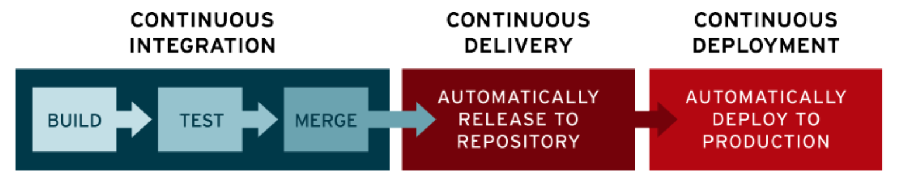

# CI/CD

CI refers to *continuous integration*, an automation process for developers  by which new code changes to ,e.g., an app are 

1. regularly built 
2. tested

CD referers to [*continuous delivery* and *continuous deployment*](https://www.redhat.com/en/topics/devops/what-is-ci-cd) 

